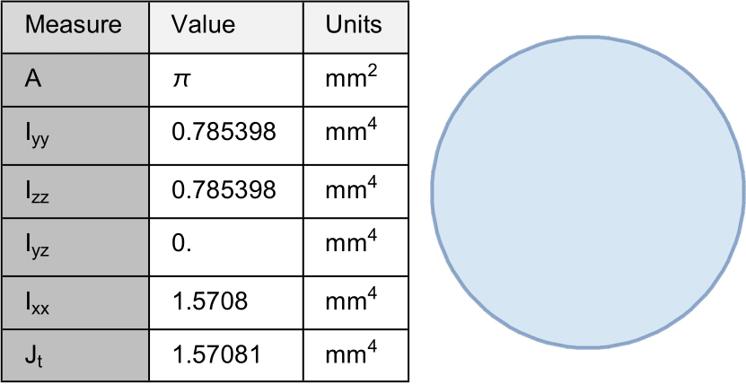

# CrossSectionTools

Compute cross section properties for an arbitrary shape in Wolfram Mathematica.

Currently supports:

 - area
 - moment of inertia
 - deviatoric moment of inertia
 - torsion constant (torsional rigidity)

