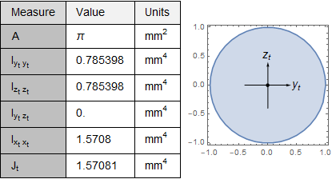
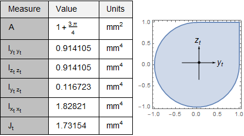

# CrossSectionTools

Compute cross section properties for an arbitrary 2D shape in Wolfram
Mathematica.

Currently supports:

- area
- centroid (mass centre)
- moments of inertia (including the deviatoric / product moment)
- torsion constant (Saint-Venant's torsional rigidity)

The output is a labelled summary grid alongside a plot of the shape with its
centroid marked:





## Requirements

- Wolfram Mathematica 11.0 or newer (uses `NDSolve`FEM``).

## Install

Releases are published as `.paclet` files on the
[GitHub Releases page](https://github.com/jantomec/CrossSectionTools/releases).

1. Download the latest `CrossSectionTools-<version>.paclet`.
2. In a Mathematica session run

   ```wolfram
   PacletInstall["/path/to/CrossSectionTools-1.0.0.paclet"]
   ```

You can also install directly from a URL:

```wolfram
PacletInstall[
  "https://github.com/jantomec/CrossSectionTools/releases/download/v1.0.0/CrossSectionTools-1.0.0.paclet"
]
```

## Use

```wolfram
Needs["CrossSectionTools`"]

\[CapitalOmega] = Disk[{0, 0}, 1];
CrossSection[\[CapitalOmega]]
```

See `CrossSectionTools.nb` for runnable examples.

The public functions are:

- `CrossSection[region]` / `CrossSection[region, units]` — full summary
  of properties (default unit string is `"mm"`).
- `TorsionConstant[mesh]` — torsion constant for a `MeshRegion` or
  `ElementMesh`.

## Uninstall

```wolfram
PacletUninstall["JanTomec/CrossSectionTools"]
```

To see what is installed:

```wolfram
PacletFind["JanTomec/CrossSectionTools"]
```

## Develop

Clone the repository and point Mathematica at the working copy so that
changes to the source files are picked up immediately:

```wolfram
PacletDirectoryLoad["/path/to/CrossSectionTools"]
Needs["CrossSectionTools`"]
```

To stop using the development copy:

```wolfram
PacletDirectoryUnload["/path/to/CrossSectionTools"]
```

To force a reload of the package during development:

```wolfram
Unprotect["CrossSectionTools`*"];
Remove["CrossSectionTools`*", "CrossSectionTools`Private`*"];
Needs["CrossSectionTools`"]
```

## Build a release

A build script is provided. Run it from the repository root:

```bash
wolframscript -file build.wls
```

This produces `build/CrossSectionTools-<version>.paclet`. Attach that file
to a new GitHub release.

Release checklist:

1. Bump `Version` in `PacletInfo.wl`.
2. Commit and tag: `git tag v<version> && git push --tags`.
3. Run `wolframscript -file build.wls`.
4. Create a GitHub release for the tag and upload the `.paclet` file
   from `build/`.

## Layout

```
CrossSectionTools/
├── PacletInfo.wl              paclet metadata
├── Kernel/
│   └── CrossSectionTools.wl   package source (the two functions)
├── Documentation/
│   └── English/
│       ├── Guides/
│       │   └── CrossSectionTools.nb
│       └── ReferencePages/
│           └── Symbols/
│               ├── CrossSection.nb
│               └── TorsionConstant.nb
├── CrossSectionTools.nb       examples notebook
├── build.wls                  builds the .paclet file
├── README.md
└── LICENSE
```

After installing the paclet, the reference pages are reachable via `?CrossSection`, `?TorsionConstant`, and through the Documentation Center (search "CrossSectionTools"). The `build.wls` script runs `PacletDocumentationBuild` so the documentation search index is included in the shipped `.paclet`.

## License

MIT — see [LICENSE](LICENSE).
